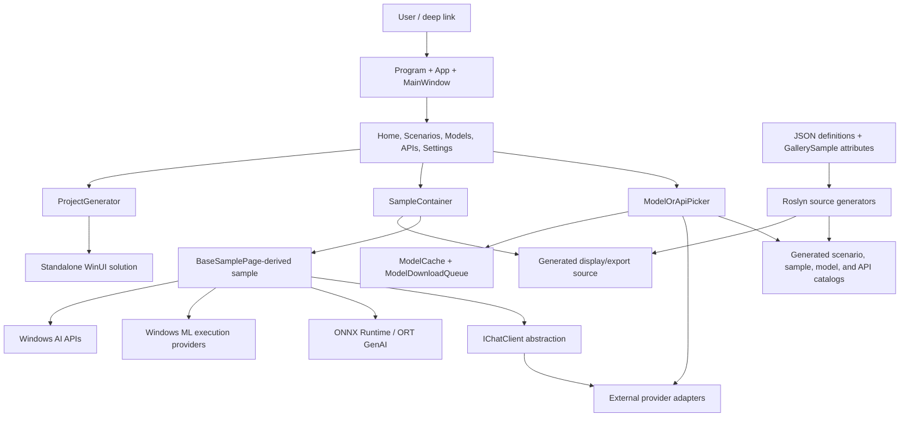
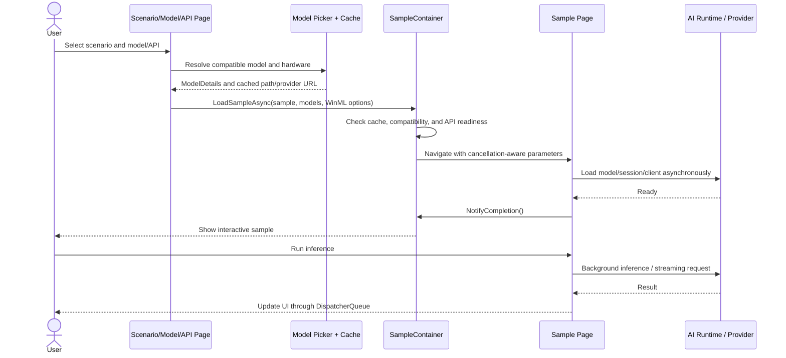

# AI Dev Gallery — High-Level Technical Design

## 1. Purpose

AI Dev Gallery is a **WinUI 3 desktop gallery for discovering, running, and exporting Windows AI samples**. It brings several AI execution paths into one app:

- Local ONNX and ONNX Runtime GenAI models
- Windows ML execution providers (CPU, GPU, and NPU where supported)
- Windows AI / Windows Copilot Runtime APIs
- External or locally hosted model services such as Foundry Local, Ollama, Lemonade, and OpenAI-compatible endpoints

The app is both a **sample browser** and a **developer tool**: users can inspect sample code, choose compatible models and hardware, run inference, and generate a standalone Visual Studio solution from a sample.

## 2. Solution Structure

| Project | Target | Responsibility |
|---|---|---|
| `AIDevGallery` | .NET 9, Windows, WinUI 3 | Main MSIX desktop app, pages, controls, samples, model management, telemetry, and project export |
| `AIDevGallery.SourceGenerator` | .NET Standard 2.0 | Roslyn generators that turn JSON definitions and sample attributes into strongly typed runtime catalogs and exportable source |
| `AIDevGallery.Utils` | .NET Standard 2.0 + .NET 9 | Shared model URL parsing and model metadata utilities used by the app, generators, and fuzz tests |
| `AIDevGallery.Tests` | .NET 9, Windows, WinUI 3 | MSTest unit, integration, UI, accessibility, and generated-project tests |
| `AIDevGallery.Fuzz` | .NET 9 | Fuzz targets for deep links and GitHub/Hugging Face URL parsing, including path-traversal checks |

The main app targets x64 and ARM64 and is configured for MSIX packaging and Native AOT compatibility.

## 3. Component View

## 4. Build-Time Metadata Design

Most gallery navigation is **data-driven but compiled into strongly typed C#**.

1. Model families, model groups, concrete models, and Windows AI APIs are declared under `AIDevGallery/Samples/Definitions/`.
2. Scenarios and prompt templates are declared in `scenarios.json` and `promptTemplates.json`.
3. Each sample page is decorated with `[GallerySample]`, which declares its unique ID, scenario, supported model types, packages, shared code, and assets.
4. Incremental Roslyn generators emit:
   - `ModelType` and model/API lookup dictionaries
   - `ScenarioType` and scenario category lists
   - Prompt-template lookups
   - `SampleDetails.Samples`, mapping metadata to page types
   - Cleaned sample/shared source used by the code viewer and project exporter
   - Central package-version mappings for generated projects
5. A Roslyn analyzer checks sample IDs for uniqueness.

This design catches many catalog errors at build time, avoids runtime reflection and JSON parsing for the core built-in catalog, and keeps the gallery UI synchronized with export metadata.

## 5. Startup and Navigation

`Program` provides a custom WinUI entry point and registers a single app instance. Secondary launches redirect activation to the existing process. URI activations such as `aidevgallery://...` are parsed into scenarios, models, APIs, or sample navigation arguments.

During launch, `App` initializes app-wide services:

- Persisted settings and recent items through `AppData`
- Diagnostic telemetry consent
- The local `ModelCache`
- The serial `ModelDownloadQueue`
- An in-memory search index built from generated scenario/model/API catalogs

`MainWindow` is the navigation shell. It routes to selection pages for scenarios, models, and APIs, hosts the global model/API picker, optionally publishes content to Windows App Content Search, and coordinates safe sample cancellation when the window closes.

## 6. Model Selection and Acquisition

A sample declares the model categories it accepts rather than hard-coding one model. Selection pages use those categories to populate `ModelOrApiPicker` from three sources:

- Built-in generated model definitions
- User-added local models
- Models reported by external providers

`IExternalModelProvider` is the service boundary for Foundry Local, Ollama, OpenAI, and Lemonade. Providers expose model discovery, URL-prefix routing, UI metadata, required packages, and creation of a common `Microsoft.Extensions.AI.IChatClient` where applicable.

For downloadable ONNX models, `ModelDownloadQueue` prevents duplicate work and processes downloads serially. Completed files are recorded by `ModelCacheStore` beneath a configurable cache directory. Foundry Local downloads and cache deletion are delegated to its provider. Windows AI API models use the platform feature-readiness and download APIs instead of the normal file cache.

## 7. Sample Runtime Flow

`SampleContainer` is the runtime boundary between gallery chrome and sample code. It:

- Verifies selected models are cached or represented by provider/API URLs
- Checks device compatibility and Windows AI feature readiness
- Creates single- or multi-model navigation parameters
- Supplies model paths, hardware selection, prompt templates, WinML options, and a cancellation token
- Waits for the sample to call `NotifyCompletion()` before leaving the loading state
- Hosts source-code tabs and debug/performance information
- Cancels outstanding loads when navigating away or closing the app

Samples inherit `BaseSamplePage` and override `LoadModelAsync`. Implementations select the appropriate runtime directly or request an `IChatClient` from the navigation parameters. Long-running inference is generally moved off the UI thread, with results marshaled back through the WinUI dispatcher. Samples own and dispose their sessions, clients, and cancellation sources on `Unloaded`.

## 8. AI Execution Paths

The app intentionally supports multiple execution styles rather than hiding every runtime behind one abstraction:

- **Language-model samples:** commonly use `IChatClient`; the factory routes to ORT GenAI, Phi Silica, or an external provider.
- **Traditional ONNX samples:** construct ONNX Runtime sessions and perform sample-specific tensor preprocessing/postprocessing.
- **Windows ML samples:** register certified execution providers and honor a saved policy or explicit EP/device choice; compiled-model use is optional.
- **Windows AI API samples:** call operating-system AI features and ensure the required feature/model is ready.

This keeps each sample educational and close to the underlying SDK while sharing selection, loading, cancellation, telemetry, and hosting infrastructure.

## 9. Standalone Project Export

The project generator turns the currently selected sample into a separate .NET 9 WinUI solution:

1. Copy the packaged WinUI project template.
2. Materialize the generated, cleaned sample XAML/C# and required shared-code files.
3. Add sample assets and exact NuGet dependencies using centrally generated package versions.
4. Inject selected model paths or external-provider client setup.
5. Optionally copy cached model files into the generated project after checking disk space.
6. Update project and publish-profile metadata, then offer to open the generated folder.

The source generators and gallery metadata are therefore part of the product architecture, not just build conveniences: they make the displayed code and exported project correspond to the running sample.

## 10. Cross-Cutting Concerns

- **State:** `AppData` persists settings, telemetry consent, cache location, WinML options, user-added model mappings, and recent items.
- **Telemetry:** typed events cover navigation, downloads, sample interactions, code viewing, and project generation; diagnostic telemetry is consent-controlled.
- **Accessibility:** the shell and sample host include narrator notifications, keyboard focus management, high-contrast handling, and dedicated accessibility tests.
- **Reliability:** sample loads and inference use cancellation; cache operations validate state; model/API compatibility is checked before activation.
- **Security boundaries:** credential storage is separated into `CredentialManager`; external URI and model URL parsing are fuzzed; generated model URLs come from repository definitions or explicit user/provider input.

## 11. Validation Strategy

The test project combines several layers:

- **Unit tests:** URL parsing, cached models, downloads, external-provider adapters, app utilities, and Windows AI API configuration
- **Integration tests:** model URL connectivity, Foundry Local behavior, API behavior, and generated-project correctness
- **UI and smoke tests:** WinUI navigation and core interactions through UI Automation/FlaUI
- **Accessibility tests:** application pages and controls
- **Performance collection:** test infrastructure can record timing and memory measurements as JSON reports
- **Fuzzing:** deep-link and model-repository URL parsers are exercised with malformed and adversarial input

## 12. Short Talk Track

> AI Dev Gallery is a data-driven WinUI shell around independently educational AI samples. JSON definitions and sample attributes are compiled by Roslyn generators into the catalogs that power navigation, compatibility, code display, and export. At runtime, a shared picker and cache layer resolves a model or Windows AI API, while `SampleContainer` manages readiness, cancellation, and the page lifecycle. Individual samples stay close to their native SDK—ONNX Runtime, Windows ML, Windows AI APIs, or `IChatClient` providers—and the same metadata can produce a standalone Visual Studio project.

## 13. Key Code Landmarks

- Startup and app services: `AIDevGallery/Program.cs`, `AIDevGallery/App.xaml.cs`
- Navigation shell: `AIDevGallery/MainWindow.xaml.cs`
- Scenario orchestration: `AIDevGallery/Pages/Scenarios/ScenarioPage.xaml.cs`
- Sample lifecycle: `AIDevGallery/Controls/SampleContainer.xaml.cs`, `AIDevGallery/Samples/BaseSamplePage.cs`
- Metadata generators: `AIDevGallery.SourceGenerator/`
- Model cache/downloads: `AIDevGallery/Utils/ModelCache.cs`, `AIDevGallery/Utils/ModelDownloadQueue.cs`
- Provider abstraction: `AIDevGallery/ExternalModelUtils/`
- Export: `AIDevGallery/ProjectGenerator/Generator.cs`
- Tests and fuzzing: `AIDevGallery.Tests/`, `AIDevGallery.Fuzz/`
